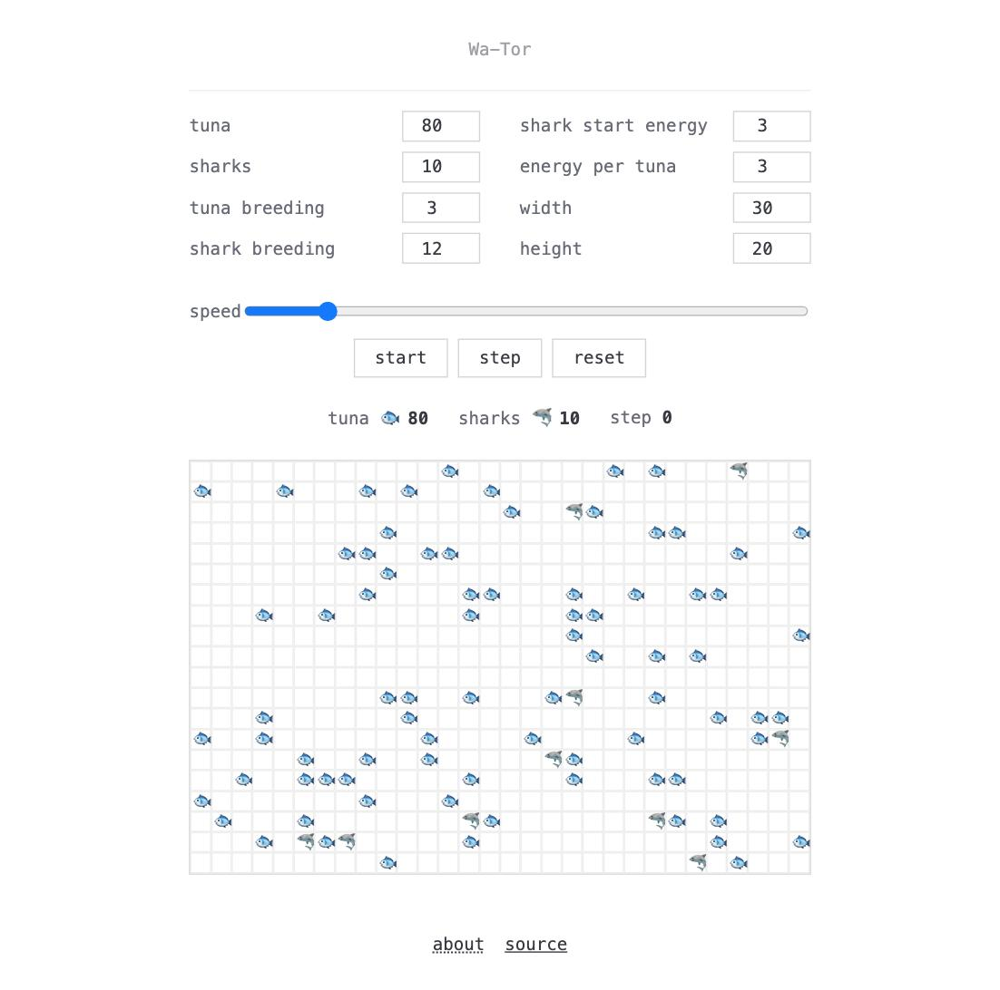

# Wa-Tor 🐟🦈



A predator/prey ecosystem simulation on a toroidal sea (it wraps around itself, like a donut), based on A.K. Dewdney's model (Scientific American, 1984). Built to practice object-oriented programming in Python.

See the full assignment in [`RESOURCES/BRIEF.md`](RESOURCES/BRIEF.md).

## Rules

- Tuna 🐟 move randomly to an empty neighboring cell and breed after surviving a number of turns.
- Sharks 🦈 move toward a neighboring tuna if there is one (and eat it), otherwise toward an empty cell. They breed after a number of turns, and starve to death if they don't eat for too long.
- The grid is toroidal: edges wrap around (top/bottom and left/right).

## Stack

A single static page, no backend, no build step. The domain classes (`Fish`, `Tuna`, `Shark`, `Grid`, `Simulation`) live in `models/` and `simulation.py` as plain Python — served as-is and run directly in the browser via [Pyodide](https://pyodide.org/) (Python compiled to WebAssembly). `app/main.js` loads Pyodide, fetches that Python source, and calls `Simulation.step()` / `.grid.to_rows()` on every tick to render the grid — no network round-trip, no server-side process.

## Run locally

No install or build needed for the page itself — serve it with any static file server:

```bash
python3 -m http.server 3000
```

Open `http://localhost:3000/app/index.html`.

## Tests

The domain classes are tested with pytest, managed with [`uv`](https://docs.astral.sh/uv/):

```bash
uv sync
uv run pytest
```

## Deploy

Static files only, no Docker. The GitHub Actions workflow runs the test suite, then (on push to `main`) pulls the repo on the VPS and rebuilds a `dist/` folder that Caddy serves directly via `file_server`.
